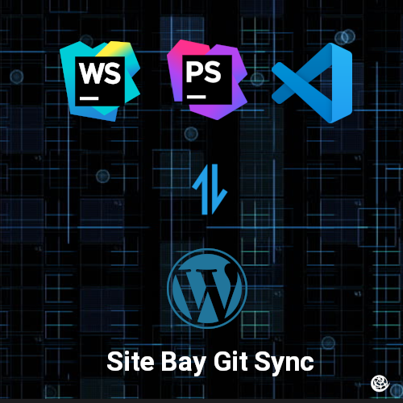

This tutorial will walk you through the necessary steps to configure your Site Bay to be an efficient remote development environment.
As a WordPress developer, you may have mastered the basics of creating themes and plugins. However, there are many advanced techniques that can take your skills to the next level and help you build more powerful and flexible WordPress sites. In this article, we will explore five advanced techniques that every WordPress developer should know.
### Custom Post Types and Taxonomies

Custom post types and taxonomies are a powerful feature of WordPress that enable you to extend the core functionality and create new types of content specific to your site. For example, you can create a custom post type for features and add custom taxonomies for feature categories and tags.

To create a custom post type, you can use the register_post_type function in your theme or plugin. This function takes an array of arguments that define the settings for your post type, such as its labels, capabilities, and supports. You can also use the register_taxonomy function to create custom taxonomies that are associated with your post type.
### Custom Fields and Meta Boxes

Custom fields and meta boxes enable you to add additional data to your post types and store it in the database. For example, you can use custom fields to add a price to your feature post type or add a subtitle to your blog post type.

To create custom fields, you can use the WordPress metadata API. This enables you to add, update, and retrieve metadata for posts and other WordPress objects. You can also use the add_meta_box function to create custom meta boxes that display your custom fields in the WordPress admin interface.

### Custom Blocks for the Gutenberg Editor

The Gutenberg editor, introduced in WordPress 5.0, is a new way to create content in WordPress. It replaces the classic editor and allows you to create content using blocks, which are modular units of content that can be rearranged and customized.

As a WordPress developer, you can create custom blocks for the Gutenberg editor. This allows you to extend the functionality of the editor and add new types of content that are specific to your site. For example, you can create a custom block for a feature grid or a testimonial slider.

To create custom blocks, you can use the WordPress block editor API. This provides a set of functions and tools that you can use to create and register your custom blocks. You can also use the WordPress block editor JavaScript components, which are pre-built UI elements that you can use to build your custom blocks.
### WordPress REST API

The WordPress REST API is a powerful tool that allows you to access WordPress data and functionality from external sources. This allows you to create custom integrations with your WordPress site and build new applications that interact with your WordPress data.

For example, you can use the WordPress REST API to create a mobile app that displays your WordPress posts or a front-end application that allows users to submit posts to your WordPress site. You can also use the REST API to create custom endpoints that expose custom data or functionality from your WordPress site.

To use the WordPress REST API, you need to install the WordPress REST API plugin. This plugin adds the necessary endpoints and functionality to your WordPress site. You can then use the WordPress REST API client libraries or make HTTP requests to the REST API endpoints to access your WordPress data and functionality.

### WordPress Hooks and Filters

WordPress hooks and filters are a powerful technique that allows you to customize the behavior of WordPress without modifying the core code. WordPress has two types of hooks: actions and filters.

Actions allow you to add custom functionality to specific points in the WordPress execution cycle. For example, you can use the wp_head action to add custom code to the <head> section of your WordPress site.

Filters allow you to modify data that is passed through WordPress. For example, you can use the the_title filter to modify the title of a post before it is displayed on the front-end of your site.

To use hooks and filters, you need to use the add_action and add_filter functions in your theme or plugin. These functions take the hook name and your custom callback function as arguments. Your callback function will be executed at the appropriate time or will receive and return the data that you want to modify.

These functions can customize the behavior of WordPress to meet your specific needs.
