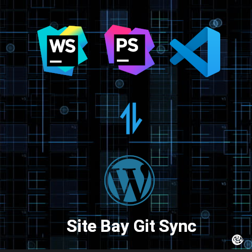

This tutorial will walk you through the necessary steps to configure your Site Bay to be an efficient remote development environment.

## Development Environments

### Local Development

A local development environment allows you to view changes instantly and allows you to use the tools you are already comfortable with rather than the less than optimal WordPress editor. 
Normally, your local client will run a stack such as LAMP (Linux, Apache, MySQL/MariaDB and PHP). LAMP is a server, which tries to simulate the one running on your web server on your local machine. You can install clients locally that contain all of these, like MAMP (Mac) or XAMPP (Mac or Windows).
However, there some drawbacks associated with local development:

* Buggy or outdated local clients can cause headaches
* If your local machine fails your entire development process stops.

However, a simple remote development environment has its own disadvantages:

### Remote Development

Some developers choose to develop right in WordPress' built in Plugin or Theme editor. This way you can see your changes instantly, but this is less than ideal because:
* You have no syntax highlighting, autocomplete, linting, and all the other features of a modern IDE.
* WordPress does not save previous versions of files.

Another option is to develop in an IDE and copy the files via SSH or FTP later.
Again this may cause problems:
* You may break your site with new changes
* Time consuming and repetitive

### Our Hybrid Recommended Approach
Use Site Bay's Git Sync with a staging site to reap the benefits of both local and remote development environments.

* Can be used on any operating system
* See changes near instantly, we check for changes every 30 seconds.
* No risk of breaking your site

## Setting Up Site Bay's Git Sync

    First, you will need to sign up for a Site Bay account and create a new project.
    Next, you will need to install our app on GitHub. This will allow you to connect your Site Bay hosted site to a GitHub repository containing your wp-content folder.
    Once you have installed the app, log in to My Site Bay and navigate to the *Account* section in the sidebar.
    Click on the "Git Sync" tab and then find your wp-content repo.
    Click Create new Site from this repo in the actions section.
    Once your site has been created, you can push your local code changes to your remote environment using an IDE. This will automatically deploy your code to your Site Bay WordPress site.
    You can also make changes to your code in your WordPress site, which will push your changes to the GitHub repository.

With Site Bay's Git Sync, you can enjoy the benefits of both local and remote development environments without the drawbacks of either approach. You can work with your favorite tools and see your changes almost instantly, without risking breaking your site.
