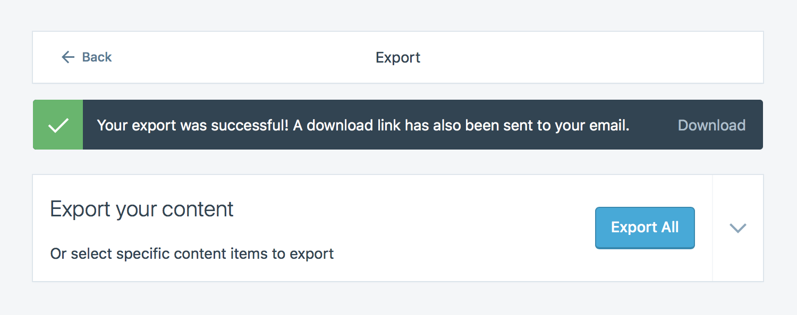

This tutorial describes how to export your content from WordPress.com and host your WordPress website on Site Bay.


WordPress.com's export feature will export pages, posts, and comments from your site, but it will not export your themes and widgets. You will need to customize your new self-hosted WordPress site's appearance after completing your migration.


## Migrate Your Website

### Create Your Site on Site Bay

Follow Site Bay's [Getting Started](/support/getting-started/) tutorial to create your first site with us. Choose a Site Bay plan with enough storage space to store the data from your current host.

### Export Your WordPress.com Content

1.  Login to your WordPress.com dashboard and navigate to the `Settings` page. Choose the `Export` option from the `Settings` page:

    

1.  Click `Export All`, then `Download` to download a compressed file of your content in XML form. A copy will also be emailed to you:

    

    To export posts, pages, or feedback from the site, press the down arrow to the right of the `Export All` button.

1.  Unzip the file.

### Import Your Content on your Site Bay hosted WordPress site

1.  Visit your Site Bay hosted WordPress site from your browser and login with your WordPress credentials.

1.  Navigate to the Import page of the Tools section. The WordPress importer plugin will be listed:

    

1.  Choose `Install Now` and then run this plugin. On the page that appears, click `Choose File` and locate the XML file you previously exported from WordPress.com to your computer:

    

1.  A page will appear that surfaces a few import options:

    

    You are able to assign your imported posts to:

    -   Your previous WordPress.com user, which will also be imported
    -   A brand new user that the import plugin will create
    -   One of the WordPress users you've already created on your Site Bay as part of deploying your web server

    **Be sure to enable** the *Download and import file attachment* option on this page.

1.  Submit this form. Your content will now be imported.

1.  Navigate to the `Permalinks` page in the `Settings` section:

    

1.  Choose the `Day and name` option and save the change. This option matches the permalink style used on WordPress.com.

## Next Steps

If you had subscribers on your WordPress.com site, you can also migrate them to your new self-hosted site. This requires that you install the Jetpack plugin and uses Jetpack's [subscription migration tool](https://jetpack.com/support/subscription-migration-tool/).
