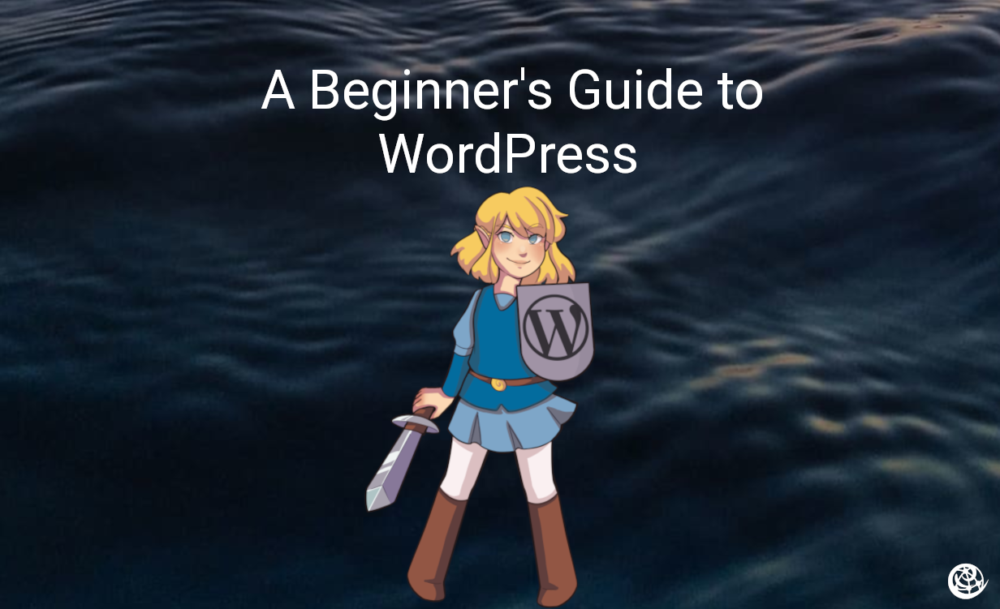

WordPress, often referred to as *WP* is a free and open source content management system (CMS) written in PHP and paired with a database (MariaDB), used by more than 40.5% of the top 10 million websites as of March 2021.
You can think of it as a factory that makes webcontent such as blog posts or pages. 

A key difference between WordPress and static webhosts such as Squarespace or Wix is that, in WordPress you can run apps that store data in your database (back-end server). WordPress is more powerful, but may have a higher learning curve due to its comprehensiveness.

In this tutorial you will learn how to [Set up your first WordPress Site](#set-up), [Add an email to allow your site to send Emails](#kubernetes-api), and [Add Plugins](#kubectl).

## Set-Up


If you don't already have a Site Bay account be sure to make one and get 20% off for a limited time using our [Intro Offer here.](https://my.sitebay.org/signup?promo=INTRO)
Then follow our [WordPress site creation tutorial](/support/tutorials/getting-started/) to get a site up and running.


First, navigate to your site's WordPress admin dashboard. Enter your site's url in your browser's address bar and add /wp-admin/ to the end of the url.
 
Next, use the email/username and password you picked at the site creation screen. The password to enter here should be different from the password you used to sign up with Site Bay.
 
The admin panel is used to manage the content for your WordPress site. This is where you can upload images, write blog posts, and design new pages for your visitors to enjoy.

 - **Blog Posts** are a type of page listed from newest to oldest. Use these to write tutorials, updates, or reviews for example. You can organize posts by adding tags or categories.

 - **Pages** are not listed by date and are normally used to display information about your site. For example, adding an About page for visitors to understand why you're doing what you're doing. Most themes display Pages in the navigation at the top of the site, but can also be displayed in the sidebar.

 - **Themes** are used to give your site a unique look and feel. All WordPress installations come with a preinstalled theme.  Themes allow users to change the look and functionality of a WordPress website without altering the core code or site content. If you used one of our Template sites a custom theme will be installed and configured for you. Otherwise, the default twentytwentyone theme will be used. You can also browse the official [WordPress.org themes directory](https://wordpress.org/themes/) to search through thousands of themes.

 - **Plugins** are used to extend the features and functionality of a site. We recommend only installing a few necessary plugins to ensure the security and performance of your site.

## Adding a Blog Post

To add a new blog post, log in to your WordPress admin dashboard and navigate to Posts > Add New.

Give your post a title and start writing your content in the text editor. You can format your text using the toolbar at the top of the editor, add images or other media using the Add Media button, and organize your post using tags and categories.

Once you are finished writing your post, you can preview it by clicking on the Preview button in the top right corner of the editor. If you are satisfied with the preview, click on the Publish button to make your post live on your site.

Congratulations, you have successfully added a new blog post to your WordPress site! You can view your post on the frontend of your site by clicking on the Visit Site button in the top left corner of the WordPress admin dashboard.
 
## Adding a Page
 
To add a new page to your WordPress site, log in to your WordPress admin dashboard and navigate to Pages > Add New.

Give your page a title and start writing your content in the text editor. You can format your text using the toolbar at the top of the editor, add images or other media using the Add Media button, and organize your page using tags and categories.

Once you are finished writing your page, you can preview it by clicking on the Preview button in the top right corner of the editor. If you are satisfied with the preview, click on the Publish button to make your page live on your site.

Congratulations, you have successfully added a new page to your WordPress site! You can view your page on the frontend of your site by clicking on the Visit Site button in the top left corner of the WordPress admin dashboard.

## Adding Plugins

Another key feature of WordPress is the ability to extend the functionality of your site with plugins. Plugins are small pieces of software that add new features and functionality to your site.

To add a plugin to your WordPress site, go to the WordPress admin dashboard and navigate to Plugins > Add New. From here, you can search for a specific plugin by keyword, or browse through the various categories of available plugins.

Once you have found a plugin that you want to install, click on the Install Now button and wait for the plugin to be downloaded and installed on your site. After the plugin has been installed, you can activate it by clicking on the Activate button.

Once a plugin is activated, you can configure its settings by going to Plugins > Installed Plugins and clicking on the Settings link for the plugin. This will open the plugin's settings page, where you can customize its behavior and settings to fit your needs.

Overall, WordPress plugins are a powerful tool for extending the functionality of your site and adding new features and capabilities. However, it's important to be selective about which plugins you install, as installing too many plugins can slow down your site and increase the risk of security vulnerabilities.

## Adding a theme

To add a new theme to your WordPress site, log in to your WordPress admin dashboard and navigate to Appearance > Themes.

On the Themes page, you can browse through the available themes by clicking on the Add New button at the top of the page. You can search for specific themes using the search bar at the top of the page, or filter themes by features and subject.

Once you have found a theme that you like, you can preview it by clicking on the Preview button. If you want to use the theme on your site, click on the Install button, and then click on the Activate button to make the theme live on your site.

To change your active theme, you can either follow the same steps as above to install and activate a new theme, or you can click on the Customize button next to the currently active theme on the Themes page to make changes to the theme's settings.

Congratulations, you have successfully added or changed your WordPress site's theme! You can view your site's new look by clicking on the Visit Site button in the top left corner of the WordPress admin dashboard.

## Next Steps

To add extra functionality, look at our [Installing Plugins Tutorial](/support/tutorials/getting-started/)

